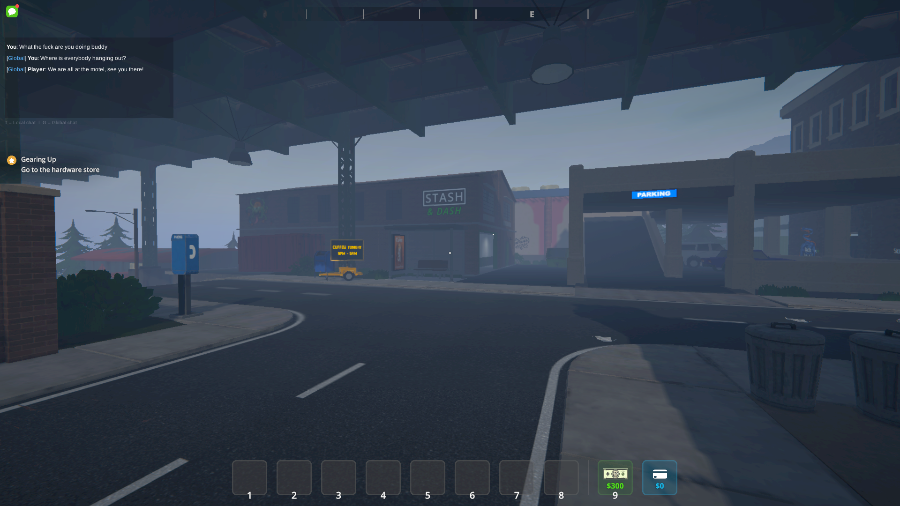

# S1DS-TextChat

A lightweight text chat overlay for Schedule I clients connected to a dedicated server, built on the S1DS mod API.



## Features

- Open **local** or **global** chat with configurable keys (defaults **U** / **Y**)
- Local messages are routed only to nearby players; global messages are sent to everyone on the server
- Chat panel is anchored near the **top-left** corner of the screen
- Messages are rendered as plain text (no rich-text parsing)
- Chat fades out after inactivity and reappears immediately when a new message arrives
- Long messages wrap cleanly inside the panel
- The client shows your own sent message immediately without waiting for a server echo
- Slash-prefixed messages (for example `/help`, `/settime 12:00`) execute through the server command system using your player permissions
- Built-in moderation commands: `/mute <player> <duration>` and `/unmute <player>` (privileged users only)
- While chat is open, the mod blocks normal gameplay input such as looking, moving inventory focus, and punching
- Message history is capped at **50** entries
- Input history (session-only) stores up to **100** submitted entries; use **Up/Down** while chat is open
- Outbound messages are sanitized and blocked client-side if they exceed `maxMessageLength`
- Server sanitizes all inbound text and enforces authoritative chat + command rate limits

## Configuration

Settings are stored at:

```
<game folder>/UserData/S1DS-TextChat.json
```

The file is created with defaults on first launch. Available options:

| Key | Default | Description |
|-----|---------|-------------|
| `localChatKey` | `"U"` | Key to open local chat. Any [Unity `KeyCode`](https://docs.unity3d.com/ScriptReference/KeyCode.html) name is accepted. |
| `globalChatKey` | `"Y"` | Key to open global chat. Any [Unity `KeyCode`](https://docs.unity3d.com/ScriptReference/KeyCode.html) name is accepted. |
| `localChatRadius` | `5` | Server-side radius, in Unity units, used to deliver local chat. |
| `maxMessageLength` | `200` | Server-side maximum message length. |
| `rateLimitWindowSeconds` | `5` | Size of one spam-check window in seconds. Counters reset when a new window starts. |
| `maxChatMessagesPerWindow` | `6` | Max normal chat messages one player can send inside a single window. Message #7 in the same window is blocked. |
| `maxCommandsPerWindow` | `4` | Max slash commands per player per window. |
| `bypassRateLimitForPrivileged` | `false` | If true, players with elevated server permissions (Administrator and above) (via `PlayerPermissions`) bypass limits. |
| `rateLimitExemptPlayerIds` | `[]` | Optional SteamID allowlist for extra rate-limit bypass entries. |

Rate limit example:

- If rateLimitWindowSeconds is 5 and maxChatMessagesPerWindow is 6, each player may send up to 6 normal chat messages every 5 seconds.
- In that same 5-second window, the 7th normal chat message is denied.
- When the next 5-second window begins, that player can send up to 6 again.

Example:

```json
{
  "localChatKey": "U",
  "globalChatKey": "Y",
  "localChatRadius": 5,
  "maxMessageLength": 200,
  "rateLimitWindowSeconds": 5,
  "maxChatMessagesPerWindow": 6,
  "maxCommandsPerWindow": 4,
  "bypassRateLimitForPrivileged": false,
  "rateLimitExemptPlayerIds": []
}
```

## Moderation Commands

- `/mute <player> <duration>`: Temporarily blocks that player from sending chat through this mod.
- `/unmute <player>`: Removes an active mute immediately.
- Duration supports suffixes: `s`, `m`, `h`, `d` (examples: `30s`, `10m`, `1h`, `2d`).
- Aliases like `1hr`, `1hour`, and `10min` are accepted.
- `<player>` can be a SteamID/TrustedUniqueId or player name. If a partial match is ambiguous, the command is rejected.
- Requires elevated permissions (same privilege check used by rate-limit bypass logic).

## Build

```bash
dotnet build S1DS-TextChat.csproj -c Mono_Client
dotnet build S1DS-TextChat.csproj -c Mono_Server
```

Build output lands in `bin/Mono_Client/netstandard2.1/` and `bin/Mono_Server/netstandard2.1/`.  If a deployment path is configured the DLL is also copied there automatically.

## Setup

### Inside the DedicatedServerMod repo

No extra configuration is needed.  The project automatically inherits game paths from the root `local.build.props` and resolves the S1DS API DLLs from the repo's `bin/` directory.

### Standalone (own repo / separate folder)

1. Copy `local.build.props.example` → `local.build.props` in this directory.
2. Set `MonoClientGamePath` / `MonoServerGamePath` to your Schedule I install.
3. Ensure the S1DS mod (`DedicatedServerMod_Mono_Client.dll` / `DedicatedServerMod_Mono_Server.dll`) is present in the game's `Mods/` folder **or** in your deployment path — the build looks in the deployment path first, then falls back to `<GamePath>/Mods`.
4. (Optional) Set `ClientDeploymentPath` / `ServerDeploymentPath` to auto-copy the built DLL after build.

`local.build.props` is git-ignored and never committed.  See `local.build.props.example` for the full annotated template.

#### Available properties

| Property | Required | Description |
|----------|----------|-------------|
| `MonoClientGamePath` | **Yes** | Schedule I **client** install directory (contains `Schedule I_Data/Managed/`, `MelonLoader/`, and `Mods/`). |
| `MonoServerGamePath` | **Yes** | Schedule I **dedicated server** install directory. Can be the same path as the client. |
| `ClientDeploymentPath` | No | After a successful `Mono_Client` build, copy the DLL here. Defaults to `<MonoClientGamePath>/Mods`. Also used as the first search location for `DedicatedServerMod_Mono_Client.dll`. |
| `ServerDeploymentPath` | No | After a successful `Mono_Server` build, copy the DLL here. Defaults to `<MonoServerGamePath>/Mods`. Also used as the first search location for `DedicatedServerMod_Mono_Server.dll`. |

#### Minimal example

```xml
<!-- local.build.props -->
<Project>
  <PropertyGroup>
    <MonoClientGamePath>/path/to/Schedule I</MonoClientGamePath>
    <MonoServerGamePath>/path/to/Schedule I</MonoServerGamePath>
    <!-- optional: override the default Mods/ deployment targets -->
    <!-- <ClientDeploymentPath>/path/to/client/Mods</ClientDeploymentPath> -->
    <!-- <ServerDeploymentPath>/path/to/server/Mods</ServerDeploymentPath> -->
  </PropertyGroup>
</Project>
```

## Notes

- Does not reference the root `DedicatedServerMod.csproj` — compiles against the pre-built DLLs in the game install.
- If `local.build.props` is configured, the built DLL is copied into the matching game `Mods` folder after build.
- The project file selects the client or server source file based on the build configuration, so each side gets a clean mod class without any `#if CLIENT` / `#if SERVER` guards.
- The client and server each create their own `UserData/S1DS-TextChat.json` file in their respective install folders.
- The on-screen chat history cap is fixed at 50 messages and is not configurable.
- Input recall history is session-only and clears when the client mod/session resets.